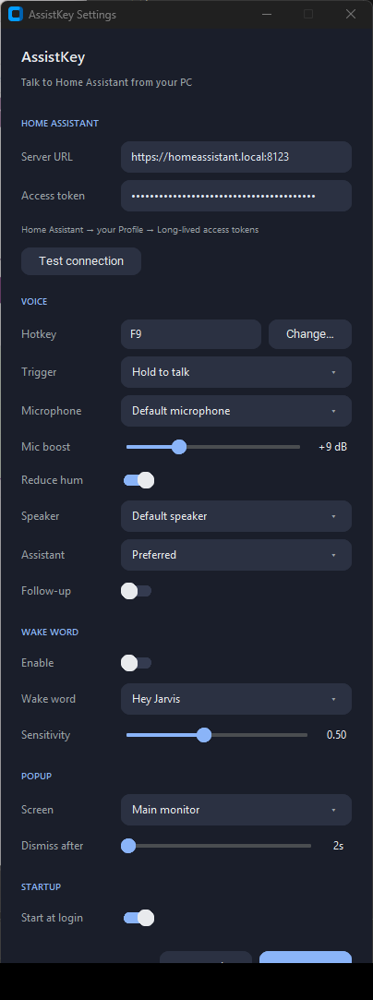

# AssistKey — push-to-talk for Home Assistant Assist

A lightweight Windows **system-tray app** that lets you talk to your
[Home Assistant](https://www.home-assistant.io/) voice assistant from your PC:
**hold a hotkey, speak, release.** No wake word, no always-listening mic — the
microphone only opens while you hold the key.

A sequence of smooth, always-on-top popups shows **Listening…**, your
transcribed words, then the assistant's reply as it streams in — and the reply
is spoken aloud.

> Works with any Home Assistant [Assist pipeline](https://www.home-assistant.io/voice_control/):
> local Whisper/Piper, cloud, or an LLM conversation agent — whatever you've set up.

> **This is a desktop app for your PC — not a Home Assistant add-on or HACS
> integration.** Nothing is installed inside Home Assistant; it connects to HA's
> WebSocket API over your network, so it works with HA OS, Container, Supervised,
> or Core.


## Features

- **Hold-to-talk** (default) or **tap-to-toggle** on a configurable hotkey.
- **Optional wake word** (off by default) — say "Hey Jarvis" (or Alexa / Hey
  Mycroft / Hey Rhasspy) to talk hands-free. Runs locally with
  [openWakeWord](https://github.com/dscripka/openWakeWord); Home Assistant's own
  voice-activity detection ends each command.
- **Streaming UI** — popups slide up from the bottom-middle of whichever monitor
  your cursor is on: Listening → Thinking (with your recognised words) → the
  streaming reply, then it slides away.
- **Spoken replies** through your chosen output device.
- **Barge-in** — press the hotkey (or click the popup, or tray → **Stop**) while
  the assistant is speaking to stop it. A live **mic-level meter** in the
  Listening popup shows you're being heard.
- **Follow-up** (optional) — when the assistant asks a question, keep talking
  without pressing the key again (ended by Home Assistant's voice detection).
- **At-a-glance status** — the tray icon is **grey** when connected, **green**
  while listening/working, **red** when Home Assistant is unreachable.
- **Encrypted token** — your access token is encrypted at rest with Windows
  DPAPI (tied to your user account), not stored in plaintext.
- **Start at login** — a one-click toggle in Settings (per-user, no admin).
- **Everything configurable** in a modern settings dialog: Home Assistant URL &
  token, hotkey, trigger mode, microphone, speaker, which assistant pipeline,
  follow-up, start-at-login, and how long popups linger.
- **Single instance** — launching again (or after an update) cleanly replaces
  the running copy, so you never get duplicate hotkey listeners.
- **Robust** — the popup is guaranteed to dismiss and the app self-recovers even
  if the connection drops or a pipeline stalls (watchdogs + a hard-hide backstop).

## Requirements

- Windows 10 or 11
- Python 3.12+ (with tkinter — the standard python.org installer includes it)
- A microphone
- A Home Assistant instance reachable over **HTTPS/WSS**, with a voice pipeline
  configured (Settings → Voice assistants)

## Install

```bat
git clone https://github.com/Defcons/assistkey.git
cd assistkey
py -m venv .venv
.venv\Scripts\python.exe -m pip install -r requirements.txt
```

## Run

- **Silent tray app:** double-click **`AssistKey.vbs`** (no console window).
- **With a console** (handy the first time / for troubleshooting): `run.bat`.

On first run the **Settings** dialog opens automatically. Enter your:

1. **Server URL** — e.g. `https://homeassistant.local:8123` (or your external
   HTTPS URL). A secure (`https`) URL is required — browsers/OS block microphone
   capture over plain `http`.
2. **Access token** — in Home Assistant, click your profile (bottom-left) →
   **Long-lived access tokens** → **Create token**.

> **Security tip:** create the token under a *dedicated* Home Assistant user
> (Settings → People → Users) instead of your admin account — then you can revoke
> just this app's access without touching anything else. AssistKey stores the
> token **encrypted at rest** (Windows DPAPI, tied to your user account).

Click **Test connection** to verify, then **Save**. You're ready — **hold F9**
and speak.

Right-click the tray icon any time for **Settings…** or **Quit**.

### Start automatically at login

Turn on **Settings → Startup → Start at login** (adds a per-user startup entry,
no admin needed). Or do it manually: put a shortcut to **`AssistKey.vbs`** in
your Startup folder (`Win+R` → `shell:startup`).

## Settings



| Setting | Notes |
|---|---|
| **Server URL / Access token** | Your Home Assistant connection. |
| **Hotkey** | Click *Change…* then press the key (or combo, e.g. `Ctrl`+`Space`). |
| **Trigger** | *Hold to talk* (hold while speaking) or *Tap to toggle* (tap on, tap off). |
| **Microphone / Speaker** | Input and output devices, or the system defaults. |
| **Mic boost** | Amplify a quiet mic (0–30 dB) before sending to Home Assistant — watch the level bar in the Listening popup and set it so your voice fills the bar without maxing out. Off by default. |
| **Reduce hum** | A gentle high-pass filter that trims low-frequency hum, rumble and DC offset. Safe for speech; off by default. |
| **Assistant** | Which HA pipeline to use; *Preferred* follows your HA default. |
| **Wake word** | Enable hands-free listening and pick the word (Hey Jarvis / Alexa / …). Off by default; downloads a small local model on first enable. |
| **Sensitivity** | Wake-word detection threshold — higher is stricter (fewer false triggers). |
| **Follow-up** | Keep listening for your answer when the assistant asks a question. Off by default. |
| **Start at login** | Launch AssistKey automatically when you sign in (per-user; no admin). |
| **Dismiss after** | How long a reply popup lingers before sliding away. |

Settings are saved to `config.json` next to the app and applied immediately —
no restart needed. **Your access token is encrypted at rest with Windows DPAPI
(tied to your user account); `config.json` is also git-ignored and never
committed.**

## A note on "live" transcription

The assistant's **reply streams in word-by-word**. Your **own speech** appears
the moment you release the key, not letter-by-letter as you talk — Home
Assistant's speech-to-text API only returns a transcript once, after the
recording ends, with no partial result while you're still talking, so this
isn't something AssistKey can add on its own. Releasing the key is what ends
the utterance (true push-to-talk; no silence detection) — and once your words
appear, they **stay on screen alongside the reply**, so you can always confirm
you were understood correctly, for as long as the response is shown.

## Development

```bat
.venv\Scripts\python.exe -m pip install -r requirements-dev.txt
.venv\Scripts\python.exe -m pytest tests/
```

### Build a standalone .exe

Bundle everything into a single `dist\AssistKey.exe` (no Python install needed to
run it). openWakeWord models still download on first enable, as in a source run.

```bat
.venv\Scripts\python.exe -m pip install -r requirements-dev.txt
build.bat
```

| File | Role |
|---|---|
| `app.py` | Entry point: tray, hotkey, asyncio loop, single-instance, GUI wiring. |
| `assist_client.py` | Async HA Assist pipeline client: audio capture, streaming, playback. |
| `wake.py` | Optional wake-word listener (openWakeWord). |
| `overlay.py` | The popup overlay (with mic meter + click-to-stop) + the settings dialog. |
| `config.py` | `config.json` load/save + credential resolution + hotkey serialization. |
| `dpapi.py` | Encrypt/decrypt the HA token at rest (Windows DPAPI, per-user). |
| `autostart.py` | Start-at-login toggle (per-user registry Run key). |
| `diag.py` | Logging + crash capture (rotating log, all-thread exception hooks). |
| `tests/` | Automated tests (config, hotkey, overlay, client, dpapi, autostart, diag). |

## Troubleshooting / logs

Everything the app does is written to **`assistkey.log`** next to the app — a
rotating file (plus `assistkey.log.1/.2/.3`) with timestamps, so it survives
crashes and restarts (the silent launcher has no console). Open it any time from
the tray icon → **Open log**.

It captures startup, connection status, and — importantly — **uncaught errors
from every part of the app** (the UI, the Home Assistant connection, the hotkey
and wake-word listeners), each with a full traceback. Your access token is
**never** written to it.

**Reporting a bug — the easy way:** tray → **Report an issue…** opens a GitHub
issue in your browser, pre-filled with the most recent error from your log and
your OS/Python version. The error text is automatically scrubbed first — your
Home Assistant address, file paths, IP addresses, and anything token-shaped are
replaced with generic placeholders before they ever reach the draft. Nothing is
sent automatically, either — it's a public issue, so give it a quick look, then
submit it yourself from your own GitHub account. Want to include the full log?
Tray → **Open log** and drag `assistkey.log` in yourself.

## License

MIT — see [LICENSE](LICENSE).

## License

MIT — see [LICENSE](LICENSE).
