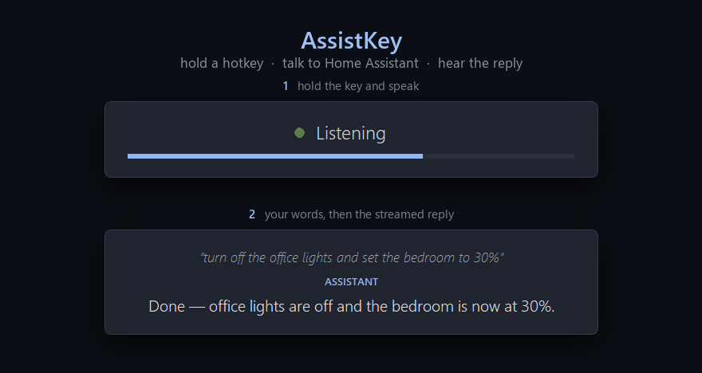

# AssistKey

Push-to-talk for Home Assistant Assist on Windows. Hold a hotkey, say something,
let go. The reply shows up in a small popup and is spoken aloud.



AssistKey is a tray app for your PC, not a Home Assistant add-on. It talks to
HA's WebSocket API and uses whatever Assist pipeline you already have (local
Whisper/Piper, Home Assistant Cloud, or an LLM agent). Nothing gets installed in
Home Assistant.

## Features

- Hold to talk, or tap to start and tap to stop. The hotkey is configurable.
- The mic is only open while you're talking.
- Popups show "Listening", then what HA heard, then the reply as it streams in.
- Press the key while a reply is playing to cut it off and talk again. Clicking
  the popup (or its ✕) just stops it.
- Optional follow-up: if the assistant asks a question, it keeps listening.
- Optional wake word (Hey Jarvis, Alexa, Hey Mycroft, Hey Rhasspy) using
  openWakeWord, running locally. The model downloads the first time you turn it on.
- The tray icon shows the connection: grey when connected, green while busy,
  red when Home Assistant can't be reached.
- The access token is encrypted with Windows DPAPI.

## Install

Download `AssistKey.exe` from the
[latest release](https://github.com/Defcons/assistkey/releases/latest) and put it
in a folder you can write to (not Program Files). Its settings and log file are
kept next to it.

The exe isn't code-signed, so Windows SmartScreen will probably warn you. Click
"More info", then "Run anyway". If you'd rather not run an unsigned exe, build it
from source (see below).

## Setup

The settings window opens on first run. You need:

1. Your Home Assistant URL, e.g. `http://homeassistant.local:8123`.
2. A long-lived access token. In HA, open your profile, go to the Security tab
   and create one under "Long-lived access tokens".

Click "Test connection", then Save, then hold F9 and talk. Every setting has a
tooltip in the settings window.

It's worth creating the token under a separate HA user, so you can revoke it
without affecting anything else.

## Good to know

- Your own words appear when you let go of the key, not while you talk. HA's
  speech-to-text only returns the text once the recording has ended.
- If a reply never comes, the popup gives up after 60 seconds. You can also click
  the ✕.
- Everything is logged to `assistkey.log` (tray menu, "Open log"). The token is
  never written to it.
- "Report an issue" in the tray menu opens a GitHub issue draft with the last
  error from the log. Your HA address, file paths and IP addresses are stripped
  out, and nothing is sent until you submit it yourself.

## Running from source

Needs Windows 10 or 11 and Python 3.12+.

```bat
git clone https://github.com/Defcons/assistkey.git
cd assistkey
py -m venv .venv
.venv\Scripts\python.exe -m pip install -r requirements.txt
```

Start it with `AssistKey.vbs` (no console window) or `run.bat` (with a console).

To run the tests or build the exe yourself:

```bat
.venv\Scripts\python.exe -m pip install -r requirements-dev.txt
.venv\Scripts\python.exe -m pytest
build.bat
```

## How this was built

I built AssistKey with a lot of help from Claude Code, Anthropic's AI coding tool,
and it's credited on the commits. I use the app every day on my own setup.
`OrientationMap.md` and the `docs/` folder are the working notes we keep while
developing; you don't need them to use or change the app.

## License

MIT
